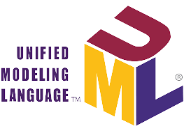

<body background-color="white">

Hi, I'm [Eljily Mohamed!] Computer Science Student 🚀 from Mauritania.

  
**Talking about Personal Topics:**

- 👨🏽‍💻 I’m currently working on MERN Stack;
- 👨🏽‍💻 CCNA1 , CCNA2 , LPIC-1 , LPIC-2 , windows server administration;
- 🌱 I’m currently learning Flask; 
- 💻 My Portfolio is at https://eljily-mohamed.github.io/
- 💬 Ask me about anything, I am happy to help;
- 🌱 Email address mohamedeljily2005@gmail.com

  
 When I'm not studying or writing code, you can find me playing [Chess ♟](https://www.chess.com/member/chedlyzouche), listening to [music]🎵, [ricing] 
 or sometimes reading 📚.

<h3 align="center">Languages and Tools:</h3>

 <a href="https://tailwindcss.com/resources" target="_blank" rel="noreferrer">     
             <a href="https://www.php.net" target="_blank" rel="noreferrer">  </a > 

## 📈 Contribution stats

  

</body>
